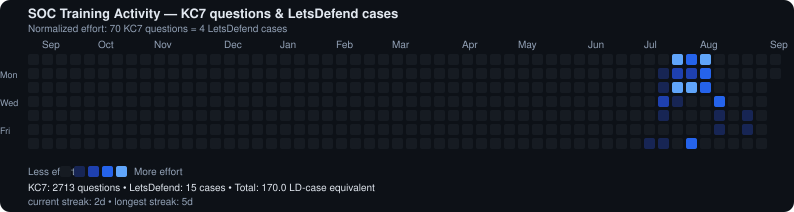

### 👋 About me

- 🎓 Third-year **Computer Science** student at **Bach Khoa University (HCMUT)**, Ho Chi Minh City
- 🛡️ Building toward a junior **SOC / Blue Team** role, with **Cloud Security** as the longer-term goal
- 🧪 Learn by building: homelab investigations, incident write-ups, and hands-on labs over theory alone
- 🔭 Currently: running detection use cases in a self-built **Wazuh** SOC homelab, and sharpening investigation skills on **KC7** and **LetsDefend**
- 📫 Reach me on [LinkedIn](https://www.linkedin.com/in/congtuan2503/)

 

### 🧰 Toolbox

`Wazuh` · `Sysmon` · `KQL` · `Splunk (learning)` · `TryHackMe / HTB` · `AWS Cloud Practitioner`

 

### 📊 GitHub stats

  
  

  

 

### 🕵️ Security training activity

Manually logged from case work on **KC7** and **LetsDefend** — neither platform has a public API, so this graph is generated from [`activity_log.json`](./activity_log.json) in this repo and refreshed automatically by a GitHub Action whenever the log changes. See [`HUONG_DAN.md`](./HUONG_DAN.md) for how to update it.

  

 

### 📌 Featured projects

  
  
  

